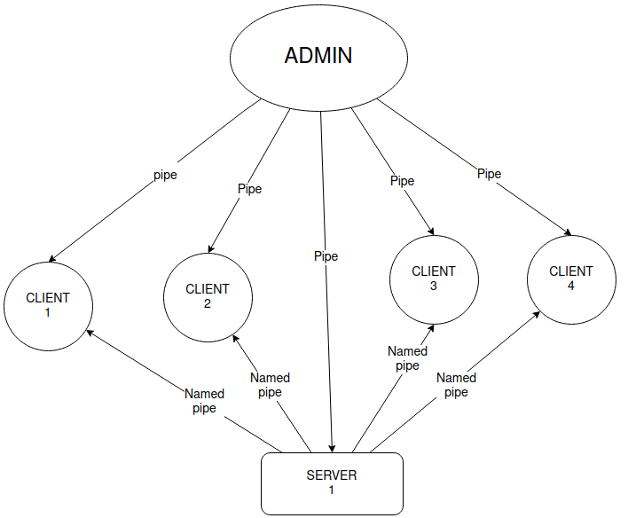

# Client-Server-model-in-Linux-Kerne 

Create a console application that can operate in two modes: a server mode and a client mode.Along with the
following condition:

• The Server should broadcast a message to all connected clients. While the clients should display the data received from the server on the console.

• At any given time, there should be only one active server in the system. If the current server goes offline,one of the connected clients should automatically become the server

# Solution 
The problem is a replicate of a well known problem in distributed system under the name Distributed Consensus. It visualize how the browser works. Each tab of the browsers is an independent process and some of the tab maintain
contact with the main browser process to receive information and distribute it to others tab process.

One of the solution this problem is based on the Byzantine Fault Tolerance algorithm, created by the famous Leslie Lamport. In which, after the server process has been terminated, the client would trade information and consensually reach an agreement to pick out a leader.

However, in my implementation, I work around problem by building an Admin process, which monitors both the server and the clients:

• All process except for the admin process is client by default

• The admin would first block read on all of its children pipe, causing all of its children to stall. We do this because if the server is dead, and clients keep reading on empty server pipe before admin can assign a new server, it would waste CPU cycle. To resolve this admin would first stall all children process, then issue a message when it's done its routine check and assignment so that children processes can carry on

• The admin process is set as the parents of all client and server process, and maintain a pipe to all of its children. It
would regularly trade message with its children to confirm the state of the situation (whether a child is terminated,
or a child is blocked, etc..), so that all process, client and server can work harmonically.

• The admin process in its routine would do period non blocking wait() to check the state of each children. Once the
server is closed, the admin would be notified thanks to it period checking process. It would then assign one of the
child process to become server via message. The server would set up the named pipes to all other process and
start broadcasting its message as usual

The overall model is as follow: 

